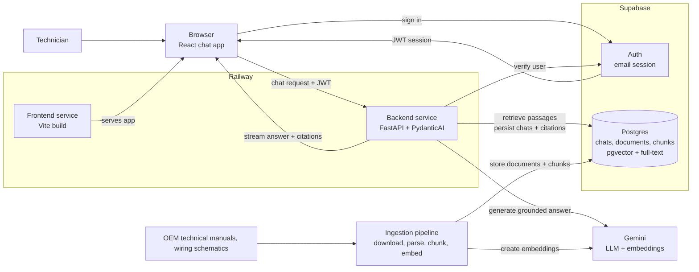

## Giga Pilot
GigaPilot is a diagnostic AI engine designed to eliminate unplanned downtime across Tesla’s Gigafactory assembly lines.

* Full Brief: [docs/client-brief.md](docs/client-brief.md)
* Full Architecture: [docs/Architecture.md](docs/Architecture.md)

------------------------------

## High-Level Architecture

Service Level Arcitecuture for GigaPilot 

## Core Stack

* Document Ingestion: Docling
* Vector Database: pgvector
* Embeddings & LLM: Gemini + Gemini 1.0 embedding 
* Retrival: Supabase `pgvector` + Postgres full-text search 
* Frontend UI: Vite + React SPA + TypeScript 
* Backend: Python + FastAPI  

