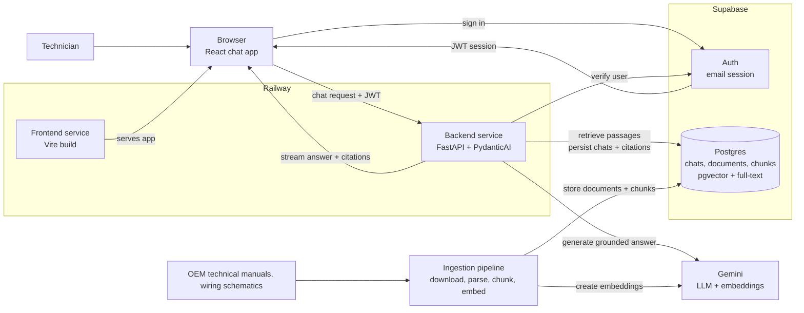

# GigaPilot Architecture

## Purpose
GigaPilot is a localized, ruggedized diagnostic AI engine designed to eliminate unplanned downtime across Tesla’s Gigafactory assembly lines.

By functioning as a digital maintenance assistant for on-the-ground crew members, GigaPilot instantly translates complex machine error codes and physical breakdown symptoms into step-by-step, safety-first repair checklists.

## High-Level Architecture

Service Level Arcitecuture for GigaPilot 

